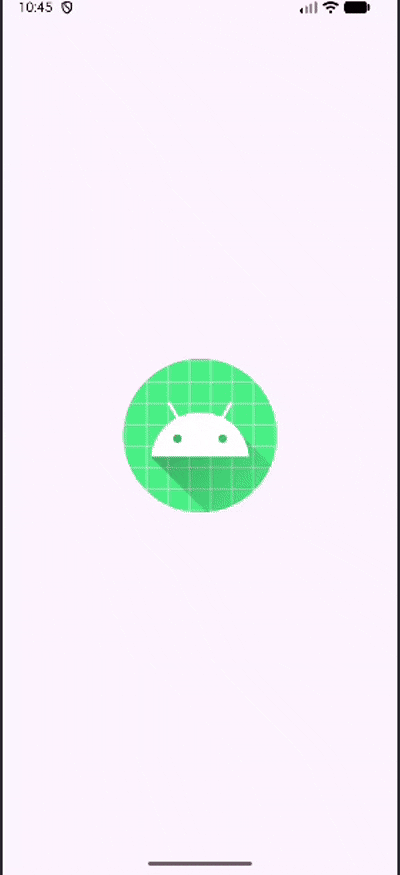
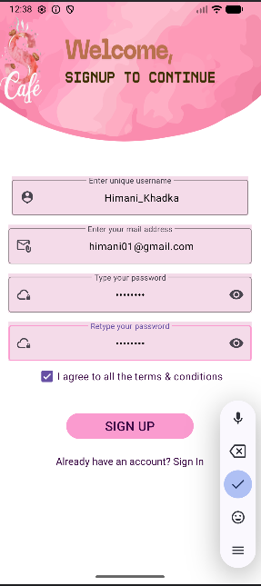
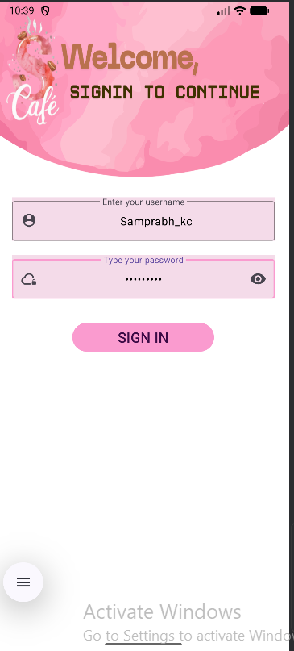
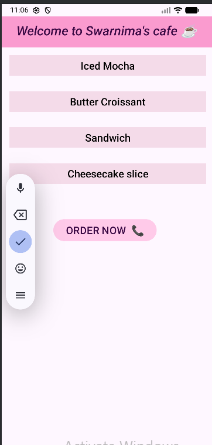
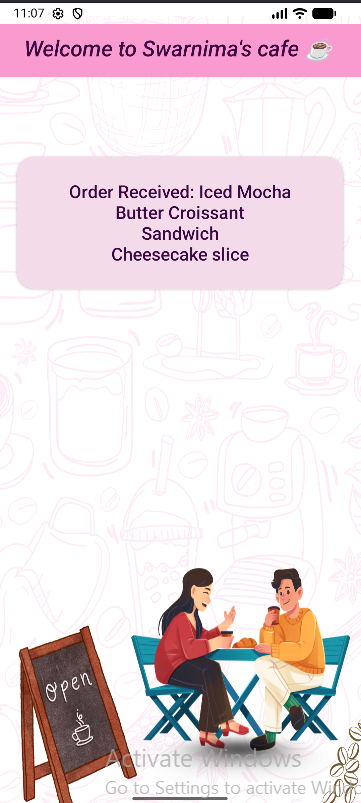

# AndroidLearnings_DataTransfer
This is simple beginner Practice of a core Android concept: **passing data between activities** and **user authentication flow** using Kotlin and Firebase Realtime Database. The app allows users to create an account, sign in securely, and access a protected screen after successful authentication.

---

##  Features
- **User Registration** - Sign-up screen collects username, email, and password with proper validation and password-match checking.
- **Firebase Integration** - Saves new user credentials securely to **Firebase Realtime Database**.
- **User Login** - Verifies username and password against Firebase-stored data.
- **Clear Feedback** - Toast messages display success (e.g., *"Login Successful"*) and detailed errors (e.g., *"Wrong Password"*, *"User does not exist"*).
- **Protected Navigation** - After login, users are taken to a protected home screen. Login/Sign-up screens close to prevent back-button access.
- **User Input Collection** – Accepts data from four EditText fields  
- **Intent-based Navigation** – Uses `Intent.putExtra()` to send data to another Activity  
- **Clean Second Screen UI** – Displays the transferred text neatly  

## Splash Screen
```markdown


## 📸 Screenshots

|SignUp Activity |SignIn Activity | Input Screen | Output Screen |
| :---: | :---: | :---: | :---: | 
| | |  |  


## How to Build from Source

Follow the steps below to run the project on your device or emulator:

1. **Clone the repository:**
   ```bash
   git clone https://github.com/Swarnima-Khadka1/AndroidLearnings_DataTransfer.git
